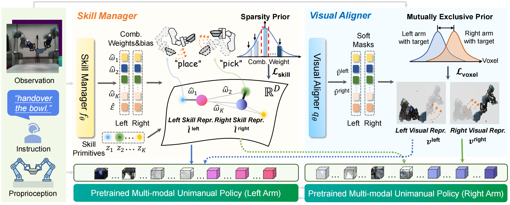

<!-- <p align="center">
  
</p> -->


### **AnyBimanual: Transferring Single-arm Policy for General Bimanual Manipulation**
[Guanxing Lu <sup>*</sup>](https://guanxinglu.github.io/), [Tengbo Yu<sup>*</sup>](https://github.com/TengBoYuu?tab=repositories), [Haoyuan Deng](https://github.com/Denghaoyuan123?tab=repositories), [Season Si Chen](https://www.sigs.tsinghua.edu.cn/Chensi_en/main.htm), [Ziwei Wang](https://ziweiwangthu.github.io/), [Yansong Tang <sup>†</sup>](https://andytang15.github.io/)

**[[Project Page](https://anybimanual.github.io/)] | [[Paper](#)]**

<!--  -->

**AnyBimanual** is a training framework to transfer any pretrained unimanual robotic manipulation policy to multi-task bimanual manipulation policy with few bimanual demonstrations. We first introduce a **skill manager** to dynamically schedule the skill representations discovered from pretrained unimanual policy for bimanual manipulation tasks, which linearly combines skill primitives with task-oriented compensation to represent the bimanual manipulation instruction. To mitigate the observation discrepancy between unimanual and bimanual systems, we present a **visual aligner** to generate soft masks for visual embedding of the workspace, which aims to align visual input of unimanual policy model for each arm with those during pretraining stage. AnyBimanual shows superiority on **12** simulated tasks from **RLBench2** with a sizable **12.67\%** improvement in success rate over previous methods. Experiments on **9** real-world tasks further verify its practicality with an average success rate of **84.62\%**.


https://github.com/user-attachments/assets/2cd23178-fde9-4af9-89c4-7cd703c88156


🎉 **NEWS**: 

- *Dec. 2024:* Codebase for both simulated and real-world experiments is released!

# 📝 TODO
- [ ] Release pretrained checkpoints.

# 💻 Installation

**NOTE**: AnyBimanual is mainly built upon the [Perceiver-Actor^2](https://github.com/markusgrotz/peract_bimanual) repo by Markus Grotz et al.

See [INSTALL.md](docs/INSTALLATION.md) for installation instructions. 

See [ERROR_CATCH.md](docs/ERROR_CATCH.md) for error catching.

# 🛠️ Usage

The following steps are structured in order.

## 🗃️ Generate Demonstrations 

Please checkout the website for [pre-generated RLBench
demonstrations](https://bimanual.github.io). If you directly use these
datasets, you don't need to run `tools/bimanual_data_generator.py` from
RLBench. Using these datasets will also help reproducibility since each scene
is randomly sampled in `data_generator_bimanual.py`.


## 🚆 Training
We use wandb to log some curves and visualizations. Login to wandb before running the scripts.
```bash
wandb login
```
To train our PerAct + AnyBimanual, run:
```bash
bash scripts/train.sh BIMANUAL_PERACT 0,1 12345 ${exp_name}
```
where the `exp_name` can be specified as you like.

To train our PerAct-LF + AnyBimanual, run:
```bash
bash scripts/train.sh PERACT_BC 0,1 12345 ${exp_name}
```

To train our RVT-LF + AnyBimanual, run:
```bash
bash scripts/train.sh RVT 0,1 12345 ${exp_name}
```

Set the `augmentation_type` in the `scripts/train.sh` to choose whether to apply the augmentation methods mentioned in our paper or to use the original SE3 augmentation.

## 🔬 Evaluation
To evaluate the checkpoint in simulator, you can use:
```bash
bash scripts/eval.sh BIMANUAL_PERACT 0 ${exp_name}
```

# 🦾 Real Robot

### 🎮 Prepare data in real world

[Demonstrations Collection by teleoperation](https://github.com/Denghaoyuan123/Bimanual_ur5e_joystick_control)

Data convert into RLbench2 form
```bash
python3 anybimanual_real_supply/data/preprocess_ntu_dualarm.py
```  
Keyframe selection
```bash
python3 anybimanual_real_supply/data/auto_keyframe_mani.py
```

### 🎯 Finetune
```bash
bash scripts/train_real.sh BIMANUAL_PERACT 0,1 12345 ${exp_name}
```

### 🕹️ Evaluation on real robot
Run model inference scripts to receive real-world observation to generate actions, here we give an example of the Agent Class.
```bash
python3 anybimanual_real_supply/eval_agent_on_robot.py
```

After receiving the action generated by the model, you can refer to [Bimanual_ur5e_action_control_for_IL](https://github.com/Denghaoyuan123/Bimanual_ur5e_action_control_for_IL) to drive dual_UR5e to perform the action.

# 🏷️ License
This repository is released under the MIT license.

# 🙏 Acknowledgement

Our code is built upon [Perceiver-Actor^2](https://github.com/markusgrotz/peract_bimanual), [SkillDiffuser](https://github.com/Liang-ZX/skilldiffuser), [PerAct](https://github.com/peract/peract), [RLBench](https://github.com/stepjam/RLBench), and [CLIP](https://github.com/openai/CLIP). We thank all these authors for their nicely open sourced code and their great contributions to the community.

# 🔗 Citation
If you find this repository helpful, please consider citing:

```
@article{lu2024anybimanual,
  author    = {Lu, Guanxing and Yu, Tengbo and Deng, Haoyuan and Chen, Season Si and Wang, Ziwei and Tang, Yansong},
  title     = {AnyBimanual: Transferring Single-arm Policy for General Bimanual Manipulation},
  year      = {2024},
}
```
